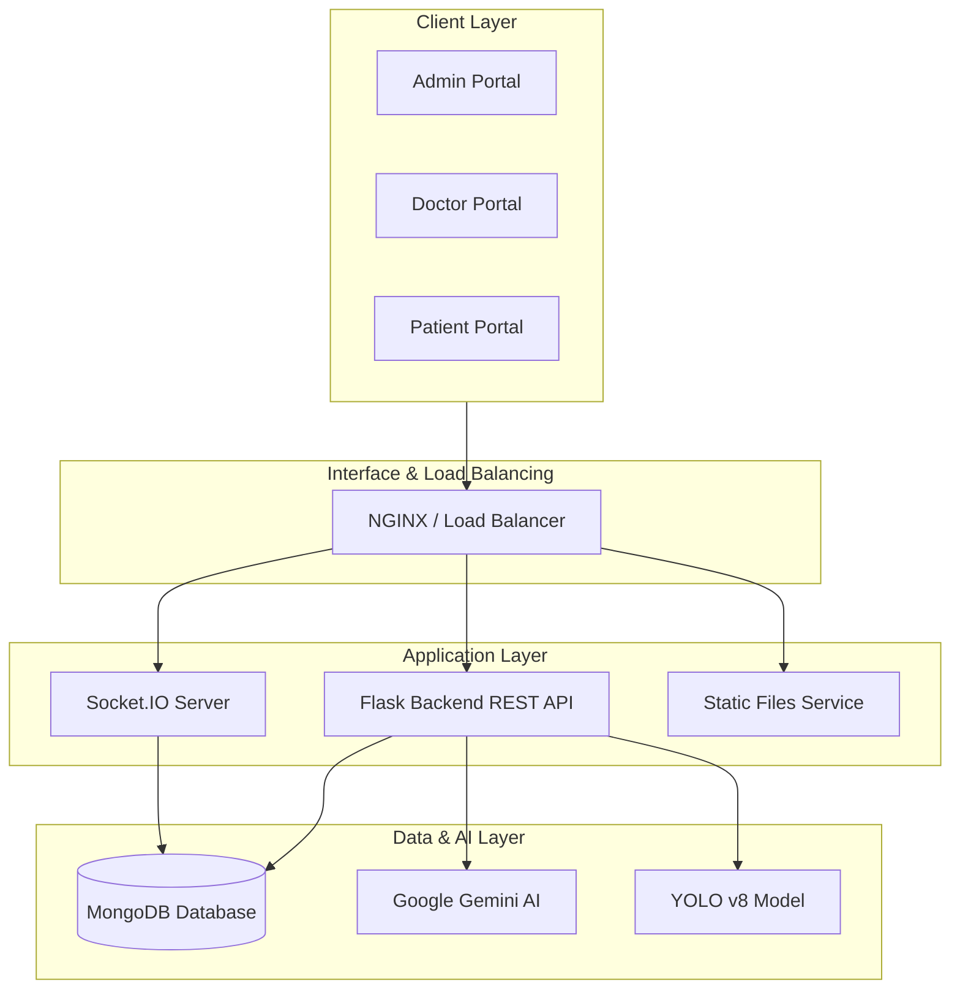

# HEALTHCARE AI - HỆ THỐNG QUẢN LÝ Y TẾ THÔNG MINH

 

> **Hệ thống quản lý bệnh viện toàn diện tích hợp Trí tuệ nhân tạo (AI) hỗ trợ chẩn đoán và điều trị chuẩn y khoa.**

---

## MỤC LỤC

1. [Giới Thiệu Chung](#1-giới-thiệu-chung)
2. [Hệ Thống Tính Năng](#2-hệ-thống-tính-năng)
3. [Công Nghệ Sử Dụng](#3-công-nghệ-sử-dụng)
4. [Kiến Trúc Hệ Thống](#4-kiến-trúc-hệ-thống)
5. [Cấu Trúc Dữ Liệu](#5-cấu-trúc-dữ-liệu)
6. [Thông Tin Dự Án](#6-thông-tin-dự-án)

---

## 1. GIỚI THIỆU CHUNG

**Healthcare AI** là giải pháp chuyển đổi số y tế, kết hợp sức mạnh của Generative AI và Computer Vision để giải quyết các bài toán cốt lõi:

* **Hỗ trợ chuyên môn:** Cung cấp "Second Opinion" cho bác sĩ trong chẩn đoán phân biệt.
* **Chuẩn hóa quy trình:** Áp dụng format SOAP (Subjective, Objective, Assessment, Plan) điện tử.
* **Tối ưu vận hành:** Quản lý lịch hẹn, hồ sơ bệnh án (EHR) và kết nối thời gian thực.
* **Phân tích hình ảnh:** Tự động phát hiện bất thường trên X-quang/CT scan.

---

## 2. HỆ THỐNG TÍNH NĂNG

### Phân Hệ AI & Y Khoa

| Module | Chức Năng Chi Tiết |
| :--- | :--- |
| **Doctor AI Copilot** | Tự động chẩn đoán phân biệt dựa trên triệu chứng lâm sàng. Đề xuất xét nghiệm (Lab tests) theo guideline y khoa. Cảnh báo dấu hiệu nguy hiểm (Red flags warning). |
| **X-ray Analysis** | Sử dụng YOLO để khoanh vùng tổn thương. Dùng Gemini Vision phân tích chi tiết và tạo báo cáo. |
| **Patient Assistant** | Giải thích thuật ngữ y khoa trong hồ sơ bệnh án. Nhắc lịch uống thuốc và tái khám tự động. Tư vấn sức khỏe 24/7 (có kiểm soát an toàn). |

### Phân Hệ Quản Lý (Portals)

| Cổng Truy Cập | Tiện Ích & Công Cụ |
| :--- | :--- |
| **Doctor Portal** | **Dashboard:** Lịch làm việc. **Consultation:** Giao diện khám chuẩn SOAP. **E-Prescription:** Kê đơn điện tử. |
| **Patient Portal** | **Booking:** Đặt lịch khám. **Records:** Hồ sơ sức khỏe trọn đời. **Telehealth:** Tư vấn từ xa. |
| **Admin Portal** | **Analytics:** Thống kê hiệu suất bệnh viện. **Management:** Quản lý người dùng & phân quyền (RBAC). |

---

## 3. CÔNG NGHỆ SỬ DỤNG

### Technology Stack

| Lớp (Layer) | Công Nghệ & Thư Viện |
| :--- | :--- |
| **Backend** | **Python (Flask 3.0)**, Pydantic, APScheduler, ReportLab |
| **Frontend** | **React 18**, Ant Design 5, TailwindCSS, Recharts |
| **Database** | **MongoDB 5.0+** |
| **AI / ML** | **Google Gemini API**, YOLO v8, PyTorch |
| **Real-time** | Socket.IO (Chat & Notifications) |
| **Security** | JWT, Bcrypt, RBAC |

---

## 4. KIẾN TRÚC HỆ THỐNG

---

## 5. CẤU TRÚC DỮ LIỆU

Danh sách các collections chính trong MongoDB:

| Collection | Mô Tả |
| :--- | :--- |
| `users` / `doctors` / `patients` | Quản lý danh tính và hồ sơ người dùng. |
| `ehr_records` | Hồ sơ bệnh án điện tử (EHR). |
| `consultations` | Phiên khám bệnh. |
| `xray_results` | Kết quả phân tích hình ảnh. |
| `appointments` / `time_slots` | Đặt lịch và quản lý khung giờ khám. |
| `audit_logs` | Nhật ký hệ thống phục vụ bảo mật. |

---

## 6. THÔNG TIN DỰ ÁN

| Hạng Mục | Thông Tin Chi Tiết |
| :--- | :--- |
| **Sinh viên thực hiện** | **Nguyễn Phạm Thái Bảo** MSSV: 2200006865 Lớp: 22DTH2A – Khoa CNTT Trường Đại học Nguyễn Tất Thành |
| **Giảng viên hướng dẫn** | **Ths. Đỗ Hoàng Nam** |
| **Liên hệ & Mã nguồn** | Email: nptb137@gmail.com GitHub: [@t0m4t0ww](https://github.com/t0m4t0ww) |

  

**Made with passion for Healthcare**  
**Đồ án tốt nghiệp – Năm 2025**

